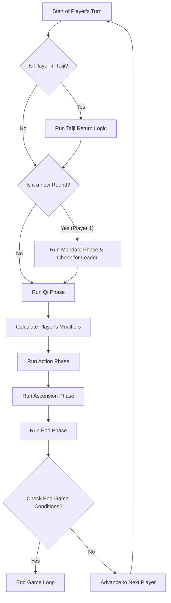

# 《天机变·周天纪》 - Python Prototype Documentation

This document explains the structure and design of the Python-based command-line prototype for the board game 《天机变·周天纪》.

## How to Run

To run the prototype in human-playable mode:
```bash
python3 game_prototype/main.py
```
To run the prototype in non-interactive bot mode for quick testing:
```bash
python3 game_prototype/main.py --bot
```

## Project Structure
The prototype is organized into several files, each with a specific responsibility:
-   `main.py`: **Game Entry Point & CLI.** Contains the main game loop and orchestrates the 5 phases of a turn.
-   `game_state.py`: **Core Data Structures.** Defines the foundational classes like `GameState`, `Player`, `Avatar`, and the `Modifiers` object.
-   `actions.py`: **Game Logic & Player Actions.** Contains all functions that modify the game state (e.g., `play_card`, `move`).
-   `game_data.py`: **Centralized Game Data.** Contains all static game data, such as Avatar definitions, Zone bonuses, and the game deck.
-   `card_base.py`: **Card Class Definitions.** Defines the basic structure of a `GuaCard` to avoid circular imports.
-   `cards_data/`: **Card Library.** A package containing individual `.py` files for each hexagram card.
-   `tian_shi_cards.py`: **Mandate Card Definitions.** Defines the global "Tian Shi" event cards.
-   `bot_player.py`: **Simple AI.** Contains the logic for a basic bot player.

## Developer Guide
This section provides a deeper look into the prototype's architecture to help new developers contribute effectively.

### Game State Flow
The main game loop in `main.py` orchestrates the 5 phases of a turn. The flow is as follows:


### The Modifier System
To handle the complex interactions of bonuses from Avatars, controlled Zones, and Tian Shi cards, we use a centralized `Modifiers` system. This avoids scattering `if` statements throughout the action logic.
-   **Definition:** The `Modifiers` dataclass is defined in `game_state.py`.
-   **Calculation:** At the start of a player's turn, the `get_current_modifiers()` function in `main.py` is called. It checks all possible sources of bonuses and populates a new `Modifiers` object.
-   **Usage:** This `mods` object is then passed to the various action functions in `actions.py`. The action functions then use the clean attributes from this object (e.g., `cost -= mods.qi_discount`) to apply their logic.

**To add a new bonus:**
1.  Add a new attribute to the `Modifiers` class in `game_state.py` (e.g., `extra_cards_on_meditate: int = 0`).
2.  Add a new `BonusType` enum for it in `game_state.py`.
3.  Add the bonus to a source (e.g., a new Avatar ability or a `GUA_ZONE_BONUSES` entry in `game_data.py`).
4.  Update `get_current_modifiers()` in `main.py` to check for this new bonus and set the corresponding attribute on the `mods` object.
5.  Finally, use the new attribute in the relevant action function in `actions.py`.

### Testing Guide
This project uses Python's built-in `unittest` framework.
-   **Running Tests:** To run all tests, execute the following command from the repository's root directory:
    ```bash
    python3 -m unittest discover tests
    ```
-   **Writing a New Test:**
    1.  Open the relevant test file (e.g., `tests/test_actions.py`).
    2.  Create a new method that starts with `test_`.
    3.  Inside the method, follow the "Arrange, Act, Assert" pattern:
        -   **Arrange:** Set up a specific `GameState` for your test case.
        -   **Act:** Call the function you want to test.
        -   **Assert:** Use `self.assertEqual()`, `self.assertTrue()`, etc., to check if the outcome is what you expected.
